# EchoSphere

## AI Interview Operating Environment

> **Tagline:** _Where Every Answer Shapes the Next Question_
> **Core Architecture:** Voice-First Intelligent Interview System with Dynamic Multi-Persona Orchestration

---

## 1. System Overview

EchoSphere is an adaptive AI interview platform where specialized interviewer personas coordinate throughout a single interview session.

Voice is the primary interaction layer. An ambient AI assistant provides:

- Interface navigation
- Contextual workspace control
- Interview assistance
- Real-time evidence capture
- Adaptive persona orchestration

The system continuously transforms candidate responses into interview context, selects the appropriate interviewer persona, generates the next question, and captures evidence for assessment.

---

## 2. Runtime State Flow

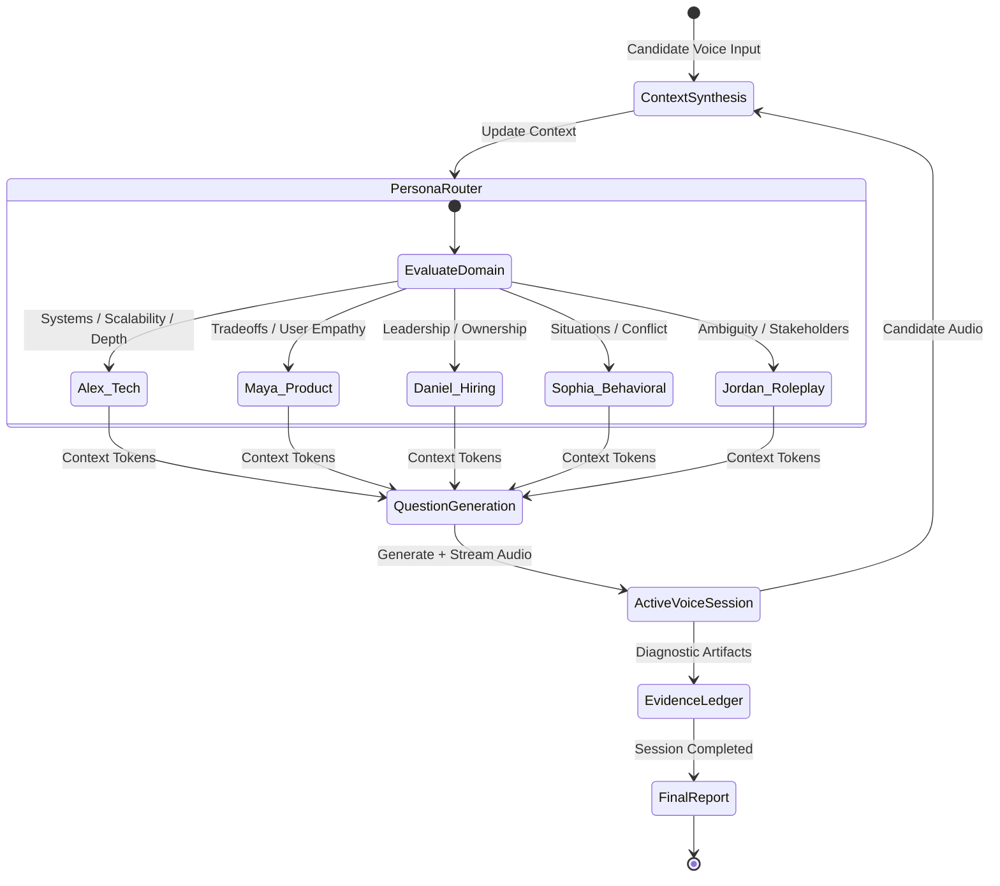

### Runtime loop

```text
Candidate Answer
       ↓
Context Synthesis
       ↓
Persona Routing
       ↓
Question Generation
       ↓
AI Voice Response
       ↓
Evidence Capture
       ↓
Candidate Answer
       ↺
```

The loop continues until the interview session is complete.

---

# 3. Complete Product Architecture

The complete experience is divided into three major stages.

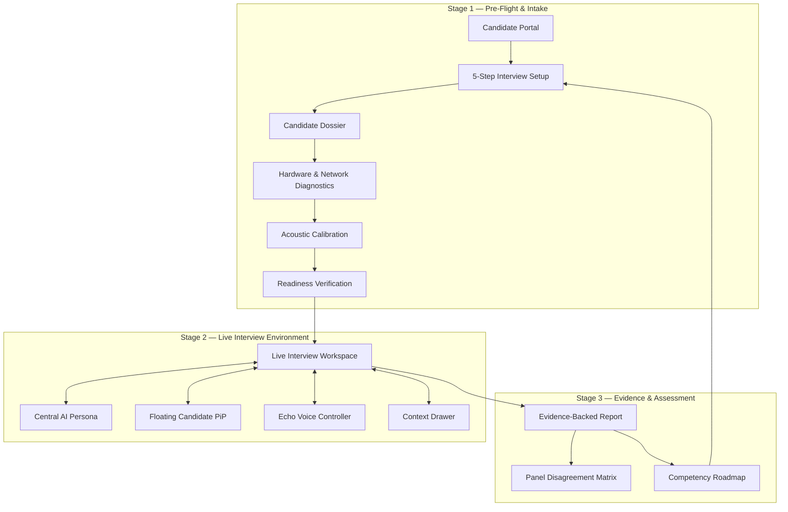

---

# 4. Candidate Setup Pipeline

The setup process remains a mandatory five-step configuration flow.

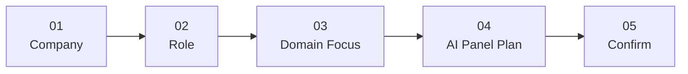

## Step 1 — Company

The candidate selects the target company.

## Step 2 — Role

The candidate selects the target role.

## Step 3 — Domain Focus

The candidate selects the relevant domain and competency focus.

## Step 4 — AI Panel Plan

EchoSphere dynamically proposes:

- Competency weighting
- Interviewer personas
- Focus areas
- Difficulty
- Interview mode

## Step 5 — Confirm

The candidate reviews the generated configuration before proceeding.

---

# 5. Environment Verification Gate

Before entering the live interview, EchoSphere performs a readiness check.

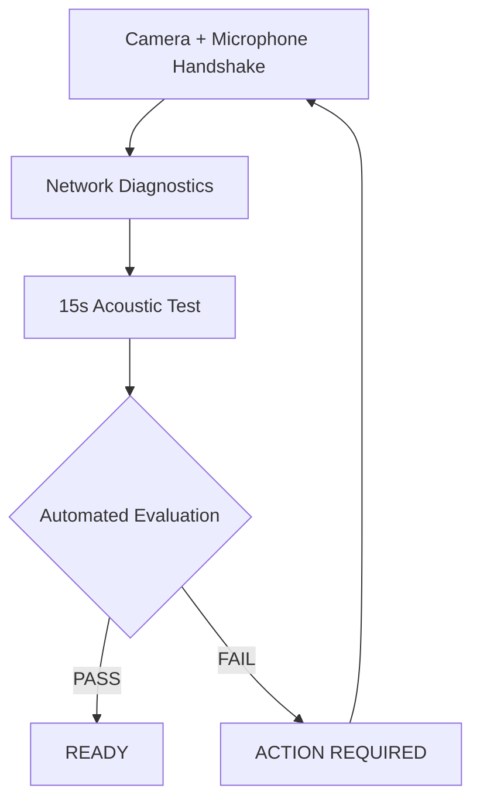

### Verification areas

| Check         | Purpose                               |
| ------------- | ------------------------------------- |
| Camera        | Access and video quality              |
| Microphone    | Access and input level                |
| Screen Share  | Sharing capability                    |
| Network       | Backend reachability and latency      |
| Acoustic Test | Voice quality and recording integrity |

---

# 6. Live Interview Environment

The live room is the central experience of EchoSphere.

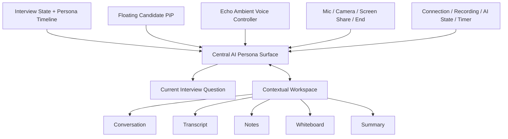

### Primary visual hierarchy

```text
┌─────────────────────────────────────────────────────────────┐
│ Persona Timeline                              Live Status   │
├─────────────────────────────────────────────────────────────┤
│                                                             │
│                                                             │
│                  AI INTERVIEWER                             │
│                                                             │
│                    Alex                                     │
│              Technical Interviewer                          │
│                                                             │
│                                                             │
│          Current interview question                         │
│                                                             │
│                                     ┌───────────────────┐   │
│                                     │ Candidate PiP     │   │
│                                     └───────────────────┘   │
│                                                             │
├─────────────────────────────────────────────────────────────┤
│                 Echo Voice Controller                       │
│                     Hey Echo                                │
├─────────────────────────────────────────────────────────────┤
│ Mic     Camera     Screen Share                  End        │
└─────────────────────────────────────────────────────────────┘
```

The contextual workspace should remain hidden or minimized until needed.

---

# 7. Persona Orchestration

Only one AI persona should actively speak at a time.

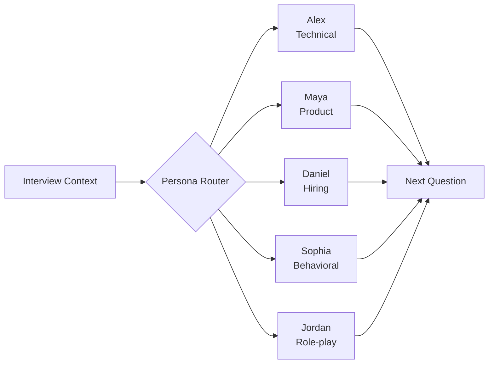

### Persona transition

A persona handoff should feel like a continuous conversation.

```text
Alex
Technical Interviewer

        ↓
   Context Handoff
        ↓

Maya
Product Manager
```

Avoid hard screen transitions or abrupt persona changes.

---

# 8. Echo Voice Interaction

Echo is an ambient voice controller rather than a conventional chatbot.

## State machine

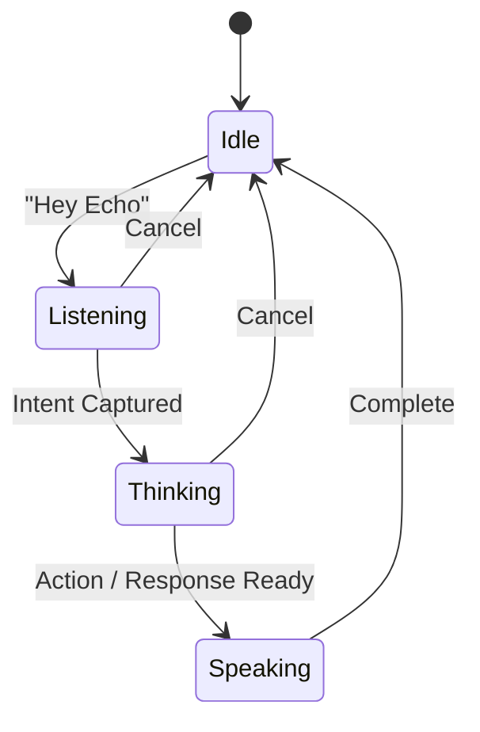

## Voice states

| State     | UI                                     |
| --------- | -------------------------------------- |
| Idle      | Small Echo Orb + "Hey Echo"            |
| Listening | Animated waveform + "Listening..."     |
| Thinking  | Pulsing orb + "Thinking..."            |
| Speaking  | AI waveform + "EchoSphere is speaking" |

---

# 9. Voice-Controlled Interface

Echo can control relevant interface surfaces.

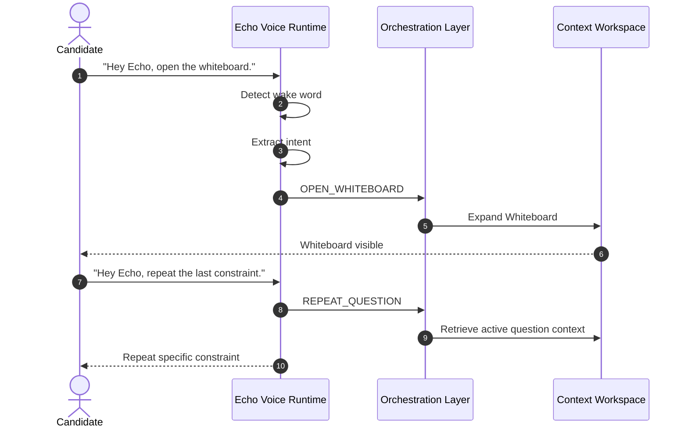

### Supported actions

```text
OPEN_PANEL
CLOSE_PANEL
NAVIGATE

OPEN_TRANSCRIPT
OPEN_NOTES
OPEN_WHITEBOARD

REPEAT_QUESTION
SHOW_PREVIOUS_QUESTION

PAUSE_INTERVIEW
RESUME_INTERVIEW

START_INTERVIEW
END_INTERVIEW

SHOW_REPORT
SHOW_ROADMAP
START_PRACTICE
```

---

# 10. Contextual Workspace

The workspace provides secondary interview context without permanently dominating the screen.

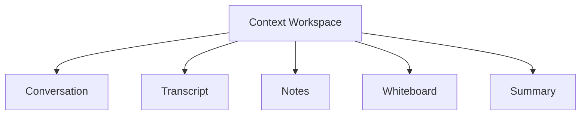

### Conversation

Live conversational context.

### Transcript

Full interview transcript.

### Notes

Candidate-created notes.

### Whiteboard

Supports:

- Architecture diagrams
- Claims
- Open threads
- Competencies

### Summary

Current interview observations.

---

# 11. Evidence Capture

EchoSphere continuously captures diagnostic artifacts throughout the session.

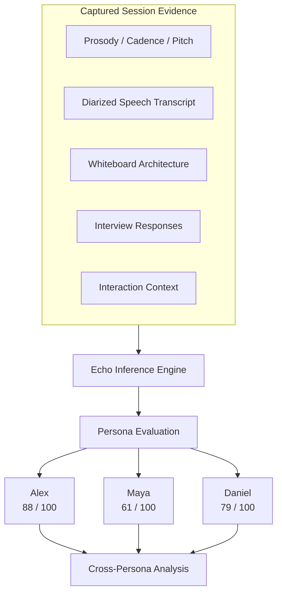

---

# 12. Cross-Persona Assessment

Different personas evaluate different dimensions.

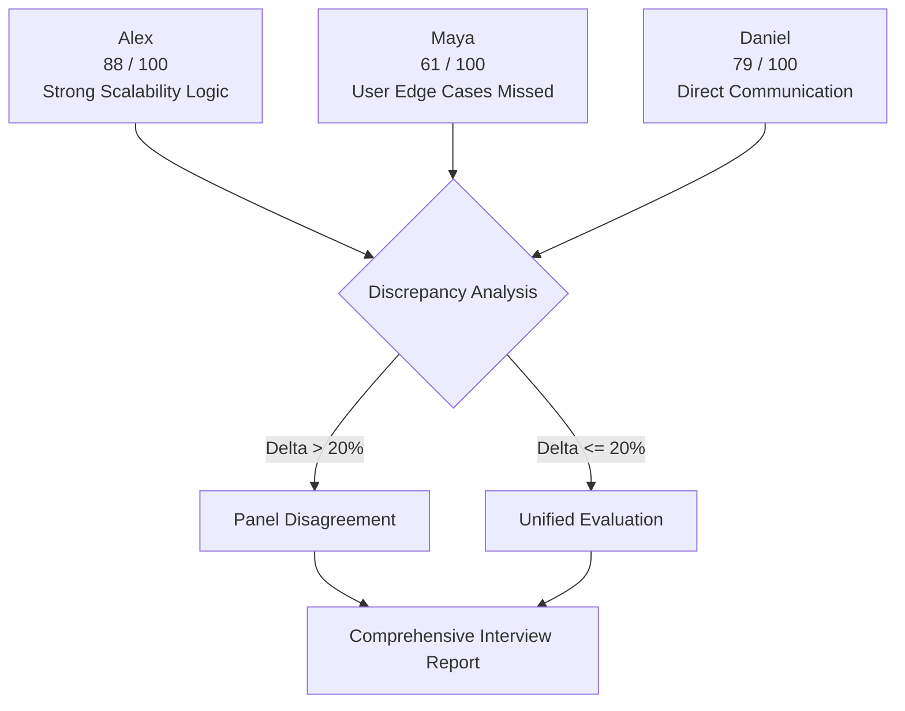

### Example evaluation

| Persona | Score | Primary observation        |
| ------- | ----: | -------------------------- |
| Alex    |    88 | Strong scalability logic   |
| Maya    |    61 | Overlooked user edge cases |
| Daniel  |    79 | Direct communication       |

The discrepancy between these perspectives becomes useful assessment evidence rather than being averaged away.

---

# 13. Assessment Pipeline

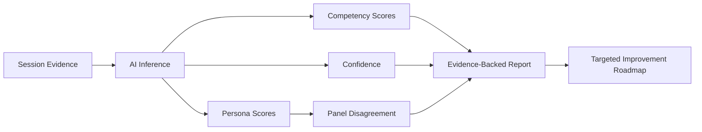

---

# 14. End-to-End System

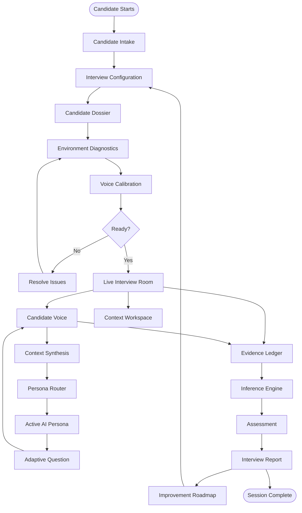

---

# 15. Architecture Principles

## Voice First

Voice is the primary interaction method.

Traditional controls remain available but secondary.

## Context First

Every question should be informed by:

- Candidate context
- Previous answers
- Competency state
- Persona perspective
- Interview progress

## Persona Specialization

Each interviewer persona should have a clear evaluation responsibility.

## Evidence First

Scores should be backed by observable interview evidence.

## Contextual UI

The interface should reveal tools when needed instead of permanently exposing every surface.

## Continuous Experience

Moving between personas, questions, workspaces, and assessment states should feel like moving through one intelligent environment.

---

# 16. Design North Star

> ## EchoSphere should feel like one continuous intelligent interview.

The candidate should always feel that:

**EchoSphere is listening.**

**EchoSphere understands the interview context.**

**EchoSphere adapts to the candidate's answers.**

**EchoSphere can navigate the environment.**

**Every answer changes what happens next.**

---

## Final System Model

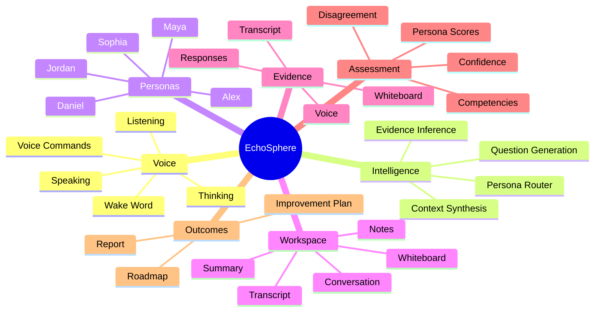

> **EchoSphere is not a dashboard with an AI assistant attached.**
>
> **It is an AI interview environment in which the assistant, interviewers, evidence, workspace, and assessment operate as one system.**
